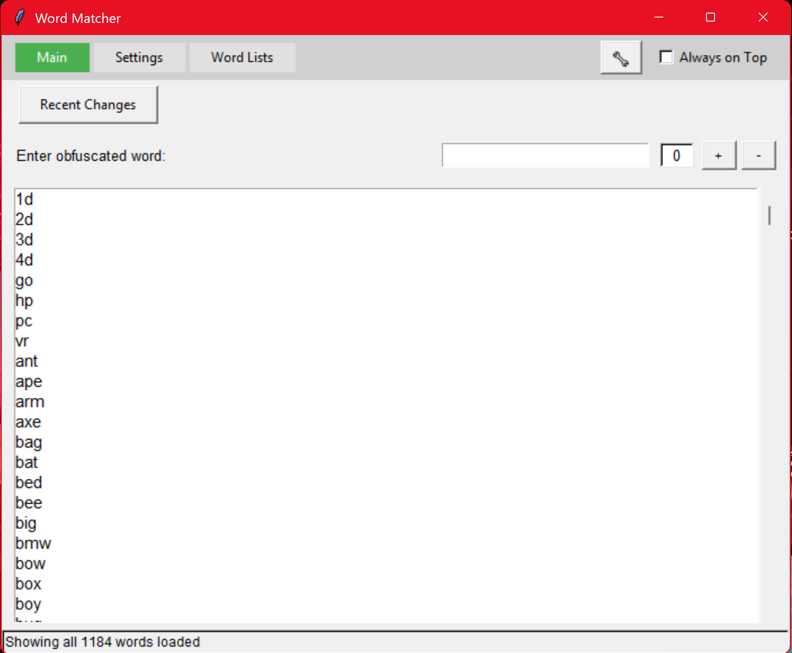
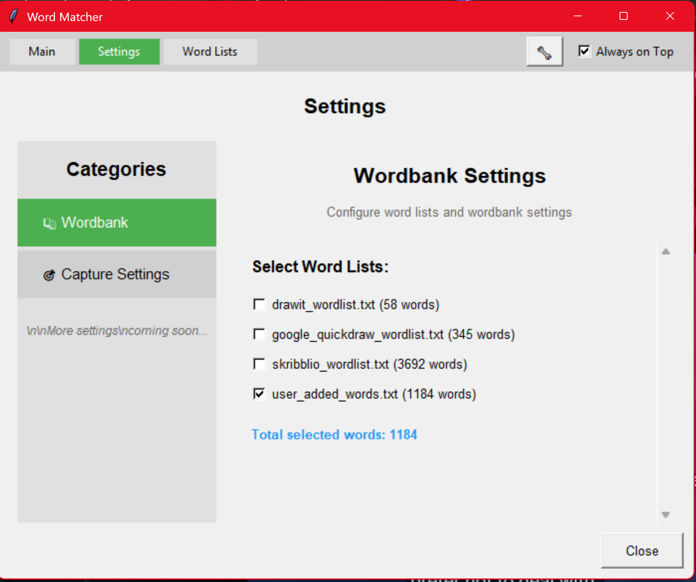
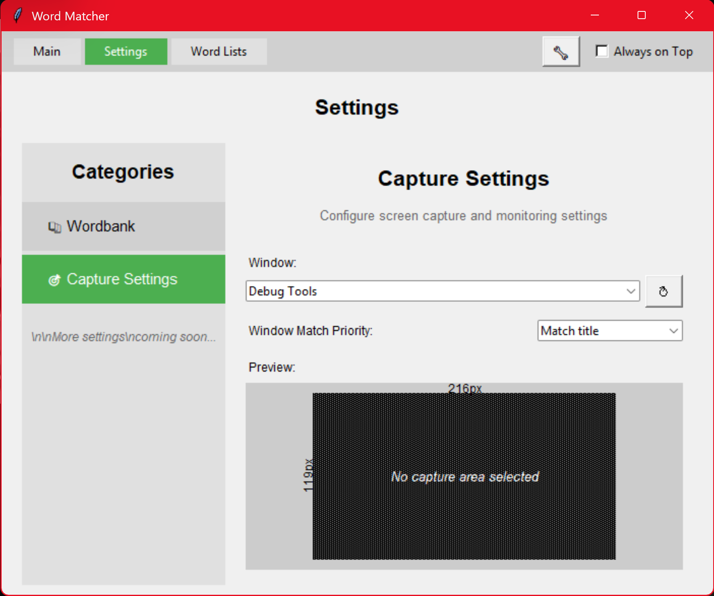

# Pictor

Real-time Pictionary assistant for drawing games.

## Features

- Enter obfuscated word patterns with real-time filtering and matching
- Frame-based navigation with embedded settings (no popup windows)
- Interactive word list selection with live preview and editing
- Configurable capture area selection for future OCR integration
- Persistent user word management (add/remove custom words)
- Always-on-top mode for overlay usage during games

## Requirements

- Python 3.8 or higher
- Dependencies listed in `requirements.txt`

## Quick Start

1. Install dependencies:

   ```powershell
   pip install -r requirements.txt
   ```

2. Run the app:

   ```powershell
   python main.py
   ```

## Screenshots

Main window with frame-based navigation and word filtering:



Embedded settings - Wordbank configuration with live word counts:



Embedded settings - Capture area configuration with window preview:



## Current Status

The application now features:
- ✅ Embedded settings system (no separate popup windows)
- ✅ Frame-based navigation with consolidated settings
- ✅ Live word filtering and pattern matching
- ✅ Persistent wordbank management (integrated in settings)
- ✅ Capture area configuration interface
- 🔄 UI navigation cleanup (removing redundant tabs)
- ⏳ OCR integration (planned)
