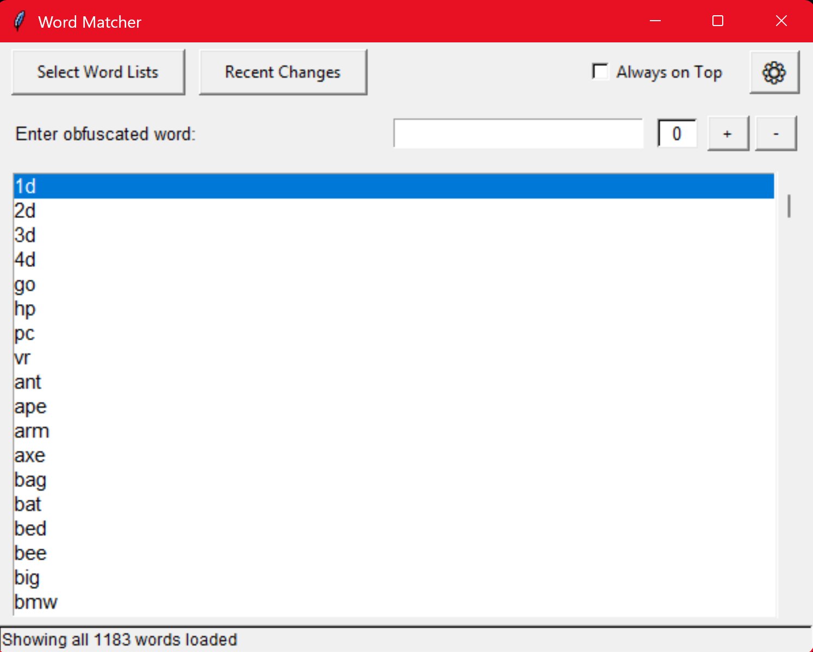
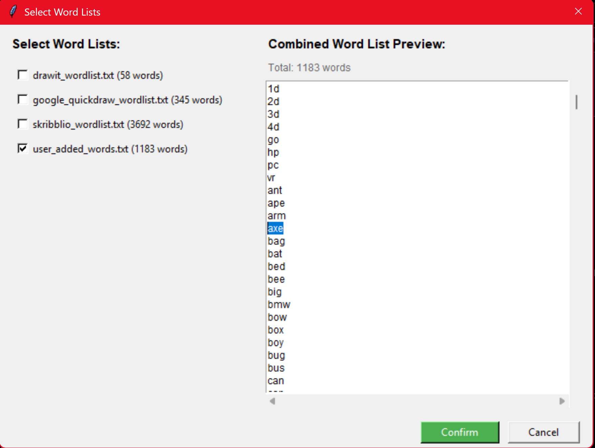
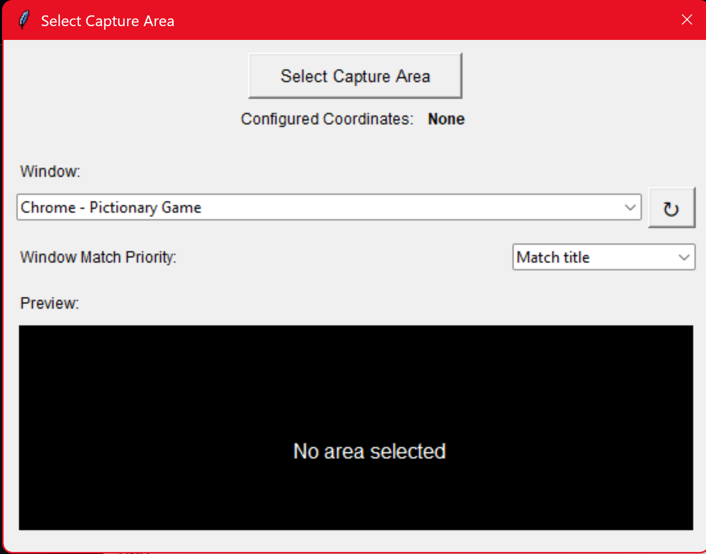

# Pictor

Real-time Pictionary assistant for drawing games.

## Features

- Enter obfuscated word patterns or use screen-capture OCR (future).
- Interactive GUI to select custom word lists and match patterns.

## Requirements

- Python 3.8 or higher
- Dependencies listed in `requirements.txt`

## Quick Start

1. Install dependencies:

   ```powershell
   pip install -r requirements.txt
   ```

2. Run the app:

   ```powershell
   python main.py
   ```

## Screenshots

Main window showing prefix search and full list:



Word list selection window with editable preview:



Capture settings prototype (buttons not yet functional):



> **Note:** The following controls are currently placeholders and will be implemented in future updates:
> - Recent Changes button
> - Select Capture Area button
> - Settings (⚙) button
